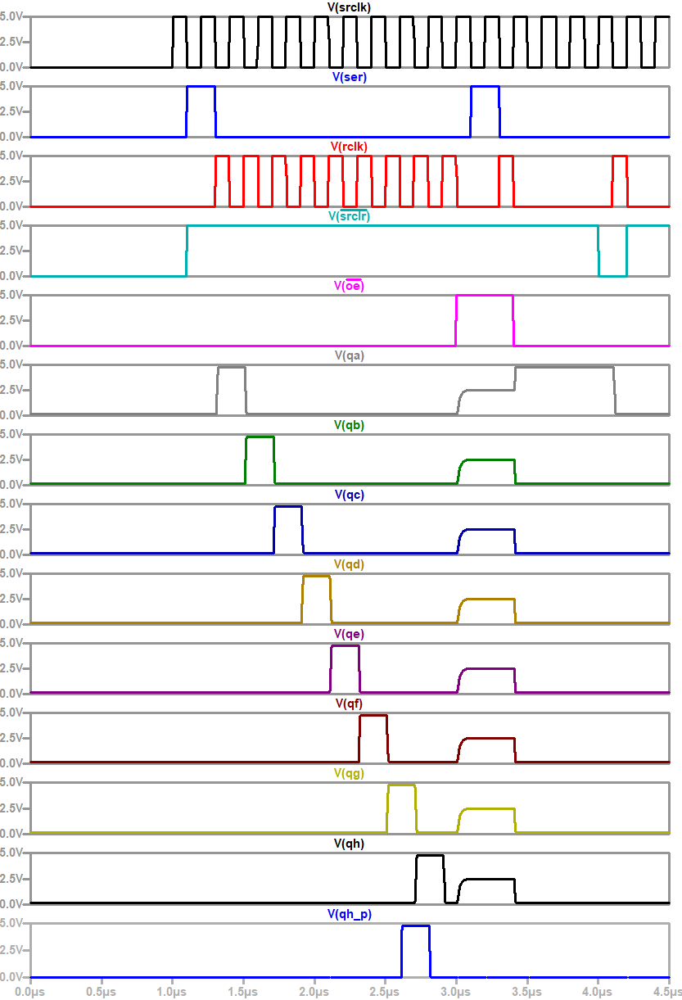
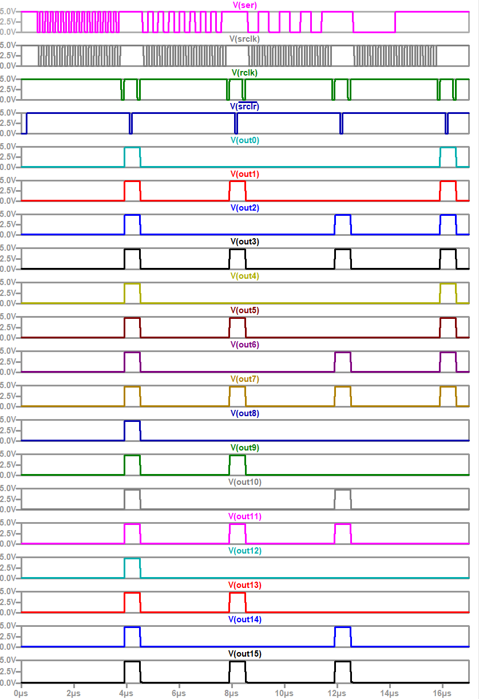

### Background

These are some 7400-series like logic devices. There are devices necessary to make a shift register, and a sim showing SPI control of a 16-bit serial to parallel converter. This type of device is useful when you need a large number of digital outputs and have limited I/O. The shift register sim is pretty slow, so its not the most practical model, but it's still fun to design logic devices from transistors.

Devices modeled:
- 74AC00 - NAND gate
- 74AC04 - Inverter
- 74AC74 - D-type flip flop with set and reset
- 74HC540  - Tri-state inverter
- 74AC595 - 8-bit shift register with tri-state outputs

- LMC555 - 555 timer, reverse engineered from die photos

### Sim Results

Here's the output from shift_register_test_bench.asc, matching timing diagram examples from 595 type devices:

Here's the SPI control of 2 shift registers, forming a 16 bit serial to parallel converter:

